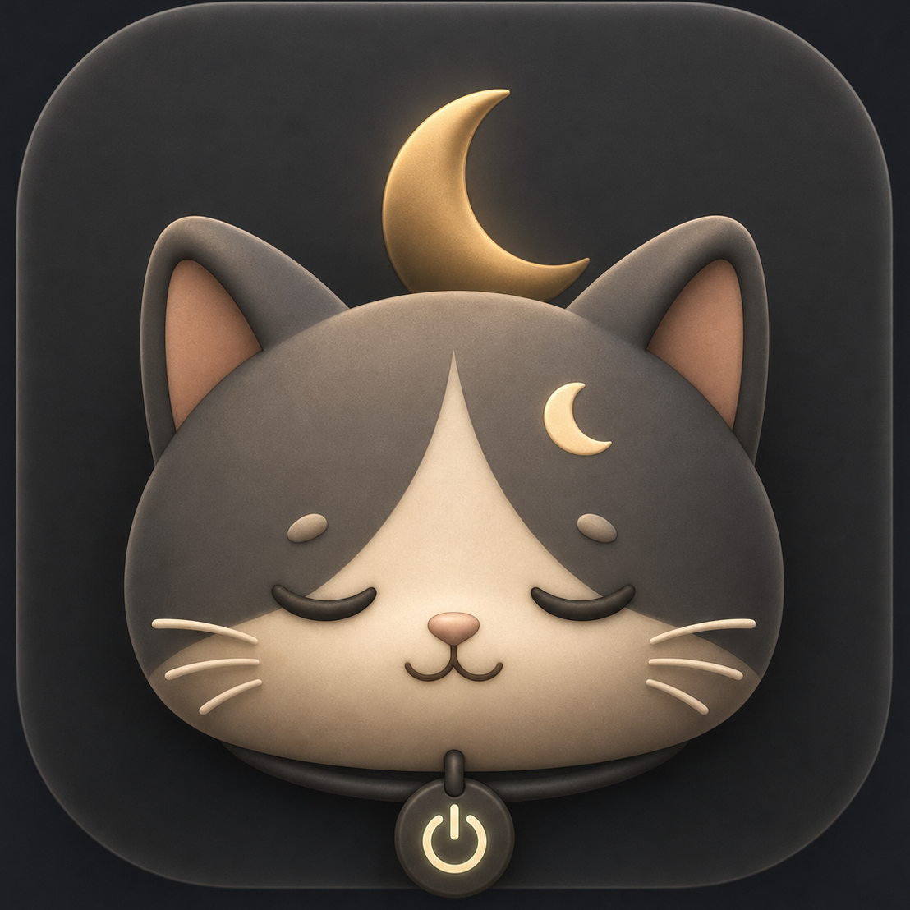

# 猫猫熄屏

英文名：SleepyCat Screen Off

<p align="center">
  
</p>

一个本地运行的 macOS 小工具。双击 `猫猫熄屏.app` 后，所有已连接屏幕会进入显示器睡眠；电脑本身继续正常工作。触碰鼠标或键盘后，屏幕恢复，后台保持唤醒的进程会自动退出。

## 下载使用

1. 在 GitHub Releases 下载 `SleepyCat-Screen-Off-macOS.zip`。
2. 解压后得到 `猫猫熄屏.app`。
3. 把 app 放到“应用程序”或桌面。
4. 双击运行。

如果 macOS 提示无法打开未验证开发者的 app，第一次可以右键点击 `猫猫熄屏.app`，选择“打开”。

如果把它固定到 Dock，单击一次即可；点完等 4 秒，不要连续双击或移动鼠标，否则鼠标活动可能会让系统拒绝熄屏或重新唤醒。

## 它做什么

- 让所有内置和外接显示器熄屏。
- 保持 Mac 本身继续运行，不主动睡眠。
- 可以熄掉所有已连接的扩展屏，同时保持电脑正常运行，适合下载、长时间本地任务和 vibe coding。
- 如果 macOS 拒绝真正的显示器睡眠，会自动切换到全屏黑屏兜底模式。
- 不联网，不上传数据，不收集信息。
- 键盘或鼠标激活后自动退出，不常驻后台。

## 重要注意

- 建议插着电源使用。
- 不要合盖；Mac 笔记本合盖通常会触发系统睡眠。
- 这不是 macOS 的“睡眠”，也不是锁屏、屏保或视频播放器的熄屏按钮。
- 它只让显示器睡眠，同时尽量让电脑继续完成下载、计算、同步或科研任务。
- 不同 macOS 版本、外接显示器、扩展坞和电源设置可能有差异。
- 如果从 Dock 启动，请单击一次后停手等待几秒钟。
- 兜底黑屏模式不是硬件断电式熄屏，但能避免 `pmset displaysleepnow` 被 macOS 拒绝时完全没有反应。

## 从源码打包

维护者在项目根目录运行：

```bash
./scripts/build_release.sh
```

生成结果：

- `build/猫猫熄屏.app`
- `dist/SleepyCat-Screen-Off-macOS.zip`

## 免责声明

本工具免费、本地、按现状提供，不提供任何担保。使用者需要自行判断是否适合自己的电脑、显示器、扩展坞和运行任务。因使用本工具造成的任何数据丢失、任务中断、硬件异常、系统异常或其他损失，作者不承担责任。
